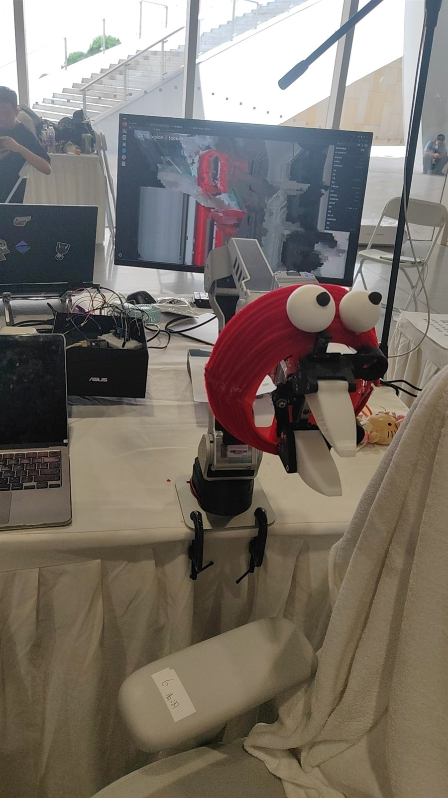
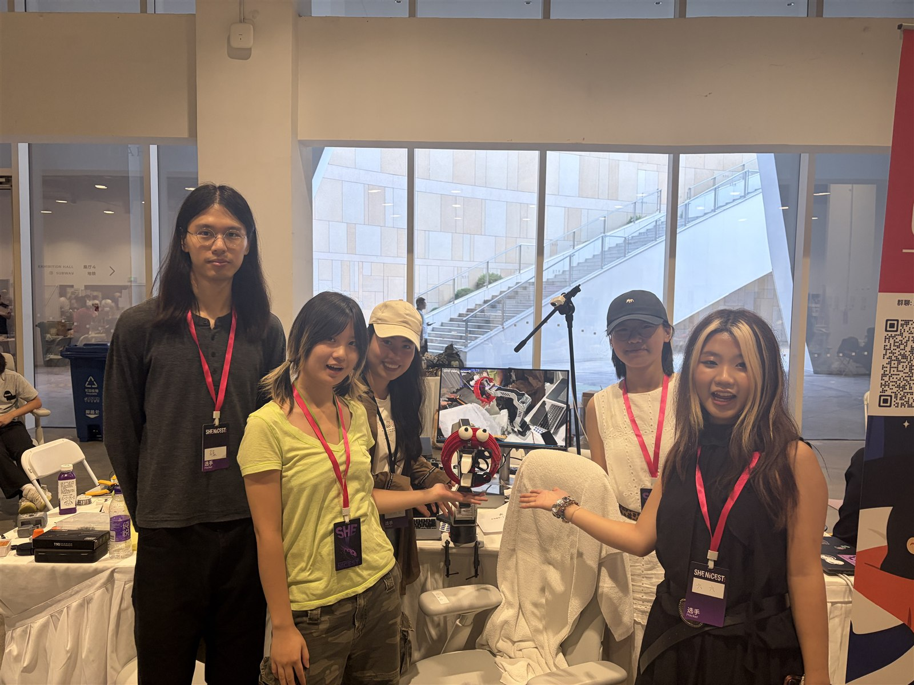

<p align="center">
  
</p>

<h1 align="center">SomniBird · 好梦鸟</h1>

<p align="center"><strong>一只赛博朋克风格的睡前机械伴生鸟</strong></p>

<p align="center">
  <a href="README.md">English</a> · <a href="README.zh-CN.md">简体中文</a>
</p>

<p align="center">
  <a href="https://github.com/lin-haiyin/SomniBird"></a>
  <a href="https://www.python.org/"></a>
  <a href="https://github.com/HighTorque-Robotics/Panthera-HT_Host"></a>
  <a href="LICENSE"></a>
</p>

> 基于官方 SDK 的六轴机械臂互动原型，用姿态、缓慢动作、夹爪节奏与视觉感知，表达一个睡前陪伴场景。

`SomniBird`（好梦鸟）诞生于一次黑客松。我们试图将 Panthera-HT 六轴机械臂从单纯的工业执行器，设计成一只具有姿态、节奏与回应能力的机械伴生鸟。

本项目通过 **HighTorque Panthera-HT 官方 Python SDK** 驱动硬件。这是独立开发原型，不代表 HighTorque 官方产品，也不暗示任何官方背书。

## 已完成内容

| 能力 | 现场证据 |
| --- | --- |
| 官方 SDK 直连 | 现场读取 J1-J6 与夹爪共 7 个电机的反馈，诊断中故障码均为 `0x00`。 |
| 命名休眠姿态 | `sleep` 与 `sleep2` 作为经过确认的回落姿态，不涉及电机工厂零点修改。 |
| 示教与回放 | 操作者可手动示教，记录为 JSONL 轨迹；场景注册与轨迹回放分离。 |
| 趣味动作 | 已围绕点头、手机干预、盖被子、植物摆动等模式设计可复用动作。 |
| 普通 USB 相机探索 | OpenCV 人脸检测与机械臂运动层隔离，作为保守 2D 跟踪的第一步。 |

<p align="center">
  
  
</p>

## 架构

```text
人工示教 / 场景请求
        |
        v
应用动作与场景管理器
        |
        +--> 命名姿态 / 已录制轨迹
        |
        v
Panthera-HT 官方 Python SDK
        |
        v
控制盒 -> CAN1 -> 六轴机械臂 + 夹爪

USB 相机 -> OpenCV 2D 感知 -> 保守的场景选择或小幅偏移建议
```

视觉模块不会直接生成无限制的关节目标。它只能选择已验证的场景，或提出小范围、经过审核的姿态偏移。

## 代码结构

- `scripts/arm_action.py`：示教、录制、回放与休眠姿态入口。
- `scripts/plant_mode.py`：平滑的持续植物摆动模式。
- `scripts/gripper_api.py`：夹爪张开、闭合和循环动作接口。
- `scripts/pose_bookmark.py`：命名姿态采集、预览与显式执行。
- `scripts/face_detect_preview.py`：仅 OpenCV 的人脸检测预览，不发送机械臂控制命令。
- `configs/poses.yaml`：原型姿态参数，单位为弧度。
- `configs/scenes.yaml`：面向应用层的场景登记表。

## 环境恢复

官方 SDK 不随本仓库分发。在新主机上取得官方 SDK 后，应重新配置本项目，而不是复用活动现场的主机路径：

```bash
source configs/environment.example.sh
"$PANTHERA_PYTHON" -m pip install -r requirements.txt
"$PANTHERA_PYTHON" scripts/check_connection.py
```

最后一条命令只读取电机反馈。新场地、新机械臂、新安装方向都必须重新检查接线、工作空间、休眠姿态和急停方案，不能直接执行此仓库中的姿态或轨迹。

## 项目边界

仓库包含项目脚本、配置样例、工程笔记及现场素材，但不包含：

- 厂商 SDK、固件及其配置；
- 已录制轨迹、主机凭据、网络地址、模型权重和运行日志；
- 已归还的现场主机及其部署环境。

因此它是有现场验证记录的原型与参考实现，不宣称可仅凭本仓库复现完整物理系统。

## 现场素材与后续路线

- [现场素材目录](assets/media/README.md)
- [原型事实与局限](docs/PROTOTYPE_NOTES.md)
- [理想技术路线](docs/TECHNICAL_ROADMAP.md)
- [发布检查清单](docs/PUBLISHING_CHECKLIST.md)

## 官方资料与致谢

- Panthera-HT Host：<https://github.com/HighTorque-Robotics/Panthera-HT_Host>
- Panthera-HT 文档中心：<https://hightorque.cn/Panthera-HT_Hub/>

使用真实硬件前，请自行获取官方 SDK，并遵守其许可证、硬件文档与安全要求。Panthera-HT 名称及相关商标归 HighTorque Robotics 所有。

## 许可证

本项目原创代码和文档采用 [MIT License](LICENSE)。厂商 SDK 与第三方模型没有被重新分发，仍遵循各自许可证。
